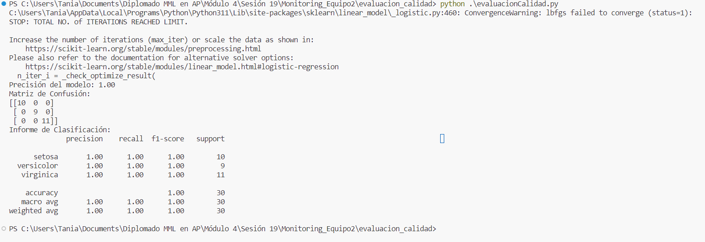

# Monitoring_Equipo2
Monitoring_Equipo2

## Práctica Monitoreo de Modelos

Compara las distancias obtenidas.

1. ¿Cómo interpretarías estos resultados?
Con respecto a la distancia de Wasserstein de 0.0 quiere decir que ambas series tienen la misma distribución, y esto se debe a que las muestras tienen los mismos valores sin importar el orden de los datos.

Con respecto a la distancia de Jensen-Shannon de 0.05 quiere decir que ambas distribuciones están relativamente cerca entre sí, pero en este caso sí importa el orden de los datos de cada muestra, a pesar de que sean los mismos, 

2. ¿Qué implicaciones tiene para la similitud o diferencia entre las distribuciones?
Para la distancia es proporcional a la diferencia entre las distrubuciones, a mayor diferencia más diferente es la forma de la distribución.

## Práctica Diferenciación entre Data Drift y Concept Drift

1. ¿Cómo cambia el rendimiento del modelo en situaciones de data drift y concept drift? Argumenta tu respuesta
Con data drift el cambio del rendimiento fue mínimo, ya que los datos fueron diferentes (se cambio el número de datos).
En concept drift el cambio de rendimiento fue mayor, ya que las distribuciones de las muestras cambiaron (se cambió el número de features).

## Práctica: Detección de Anomalías con Isolation Forest y One-Class SVM

Explica los resultados obtenidos además de los métodos para detectar anomalías (debes explicarlo NO solo mencionarlo)
Los puntos marcados com ooutliers fueron marcados por los algortimos de IsolationForest y SVM, asimismo, visualmente se confirma que la distancia entre los outliers y las clasificaciones son intutitivas.

## Práctica: Evaluación de la Calidad de un Modelo de Machine Learning

1. Explica en tus palabras la evaluación del presente modelo de acuerdo a la precisión.
El resultado de la precisión puede deberse a que las muestras que se están usando para probar el modelo están muy bien diferenciadas y no hay ningún caso límite, sin embargo, puede darse el caso de que exista overfitting.

2. Explica en tus palabras la evaluación del modelo de acuerdo a la matriz de confusión.
La precisión del modelo fue de 1, y en la matriz de confusión de puede corroborar, ya que todos los valores se encuentran en la diagonal, lo que quieres decir que todas las etiquetas fueron asignadas correctamente.

## Práctica Dashboard

1. Explica cada una de las métricas que ves en el dashboard y has una interpretación de las mismas respecto a lo que ves en las gráficas

