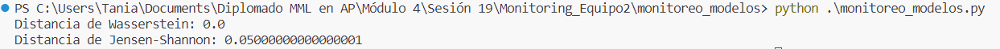

# Monitoring_Equipo2

## Práctica Monitoreo de Modelos

Compara las distancias obtenidas.

1. ¿Cómo interpretarías estos resultados?

2. ¿Qué implicaciones tiene para la similitud o diferencia entre las distribuciones?

## Práctica Diferenciación entre Data Drift y Concept Drift

1. ¿Cómo cambia el rendimiento del modelo en situaciones de data drift y concept drift? Argumenta tu respuesta

## Práctica: Detección de Anomalías con Isolation Forest y One-Class SVM

Explica los resultados obtenidos además de los métodos para detectar anomalías (debes explicarlo NO solo mencionarlo)

## Práctica: Evaluación de la Calidad de un Modelo de Machine Learning

1. Explica en tus palabras la evaluación del presente modelo de acuerdo a la precisión.

2. Explica en tus palabras la evaluación del modelo de acuerdo a la matriz de confusión.

